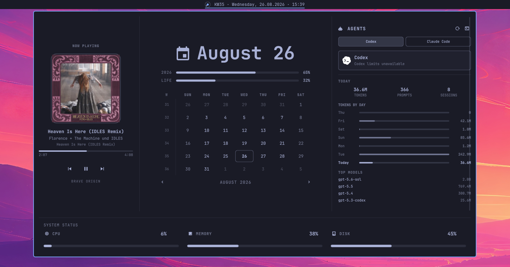

# Omarchy Clock Hub

A theme-aware replacement for `omarchy.clock` that turns the clock popup into
a compact desktop hub.



## Features

- Configurable weekday, ISO week, date, and time label
- Animated, theme-aware now-playing indicator in the bar
- Full Omarchy calendar with week numbers and month navigation
- MPRIS media card with artwork, progress, and playback controls
- Omarchy Agents dashboard with provider limits, daily usage, and model totals
- Live CPU, memory, and root-disk status across the bottom of the hub
- Automatic upstream change detection after `omarchy update`

The hub reuses Omarchy's running `omarchy.media` service and the live
`omarchy.agents` widget. It does not start duplicate media or usage collectors.

## Requirements

- Omarchy 4.0 or newer
- The stock `omarchy.media` service
- `omarchy.agents` in the bar for the Agents dashboard
- `bash`, `awk`, `df`, and the Linux `/proc` filesystem for system status

## Installation

Review third-party plugins before enabling them. Then install from GitHub:

```bash
omarchy plugin add https://github.com/nibra180/omarchy-clock-hub.git --enable
```

Omarchy places the plugin in:

```text
~/.config/omarchy/plugins/io.github.nibra180.clock-hub/
```

The plugin declares `clonedFrom: omarchy.clock`, so enabling it replaces the
stock clock while retaining Omarchy's clock IPC routes.

## Recommended clock format

Add or adjust the Clock Hub entry in `~/.config/omarchy/shell.json`:

```json
{
  "id": "io.github.nibra180.clock-hub",
  "format": "'KW'ww · dddd, dd.MM.yyyy · HH:mm"
}
```

Right-clicking the clock cycles through the available formats. Left-clicking
opens the hub; middle-clicking opens Omarchy's timezone picker.

## Optional upstream notifications

Install the included post-update hook:

```bash
omarchy hook install post-update \
  ~/.config/omarchy/plugins/io.github.nibra180.clock-hub/tools/post-update-check
```

It only reports upstream changes. It never overwrites local QML. See
[`UPSTREAMS.md`](UPSTREAMS.md) for the review workflow.

## Development

```bash
qmllint -I /usr/share/omarchy/shell AgentsHub.qml MediaHub.qml Panel.qml SystemStatus.qml VinylIndicator.qml
omarchy plugin validate ~/.config/omarchy/plugins/io.github.nibra180.clock-hub
omarchy restart shell
```

Plugin files hot-reload while editing. Keep personal settings in
`~/.config/omarchy/shell.json`; do not commit them to this repository.

## License

MIT. This project contains code derived from Omarchy and Asked Dashboard, and was inspired by Ruixen Shell.
See [`THIRD_PARTY_NOTICES.md`](THIRD_PARTY_NOTICES.md).
